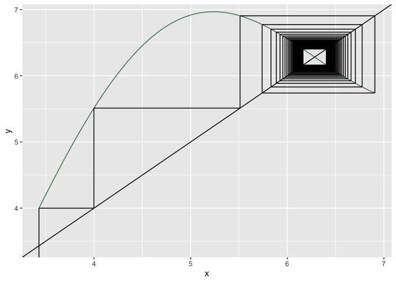
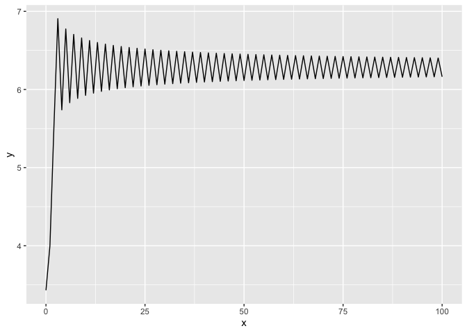

## Graphical iterator program

I’ve written a simple graphical iterator program to help make graphical
iterations on the fly. Here it is:

I can’t guarantee it’ll work for all functions you throw at it, but then
again, I can’t think of any reason why it wouldn’t. Let me know if you
come across any or issues!

## Setup

``` r
# set your initial condition and desired number of iterations:
x_0 <- 3.43
N <- 100

# set the iteration plot x axis range (lower and upper bounds):
x_min <- 0; x_max <- 8
y_min <- -2; y_max <- 8

use_custom_range_x <- FALSE
use_custom_range_y <- FALSE

# declare your function here:
func <- function(x){
  return(-2 * sin(x) + x) # function goes here
}
```

## The nitty-gritty

``` r
get_function_data <- function(range = c(-1, 1), steps = 100){
  
  steps_multiplier <- (range[2]-range[1])/10 
  if(steps_multiplier < 1){steps_multiplier <- 1}
  # adds steps to get data for depending on the number of 10s 
  # in the specified plot x range
  
  x <- seq(from = range[1], to = range[2], length.out = steps * steps_multiplier)
  
  y <- array(dim = steps * steps_multiplier) 
  for(i in 1:length(x)){
    y[i] <- func(x[i])
    } 
  
  return(data.frame(x = x, y = y))
}

graphical_iterator <- function(x_0, N = 100){ 
  
  start <- x_0 
  vert <- FALSE 
  
  xstarts <- c(start)
  ystarts <- c(y_min)
  xends <- c(start)
  yends <- c(func(start)) 
  
  # iteratively get the coordinates of the next segment points
  for(i in 1:(2 * N)) 
    # range = 2 * N because every step will be described by two segments
  {
    # if the last segment was vertical, the next must be horizontal
    if(vert){
      xstarts <- c(xstarts, start)
      ystarts <- c(ystarts, start)
      xends <- c(xends, start)
      yends <- c(yends, func(start)) 
      vert <- FALSE
    }
    else{
      xstarts <- c(xstarts, start)
      ystarts <- c(ystarts, func(start)) 
      xends <- c(xends, func(start)) 
      yends <- c(yends, func(start)) 
      vert <- TRUE
      start <- func(start) # update start value
    }
  }
  return(data.frame(xstarts, ystarts, xends, yends))
}

cobweb_traject <- graphical_iterator(x_0 = x_0, N = N)

if(use_custom_range_x == FALSE){
  x_min <- min(cobweb_traject$xstarts); x_max <- max(cobweb_traject$xends)
}
if(use_custom_range_y == FALSE){
  y_min <- min(cobweb_traject$xstarts); y_max <- max(cobweb_traject$xends)
}

plot_data <- get_function_data(range = c(x_min,x_max))


get_function_iteration_trajectory <- function(x_0, N = 100){
  
  x_t <- x_0
  trajectory <- c(x_t)
  
  for(t in 0:(N-1)){
    x_t <- func(x_t)
    trajectory <- c(trajectory, x_t) # add x_t_1's value to the trajectory vector
  }
  return(trajectory)
}

trajectory <- get_function_iteration_trajectory(x_0 = x_0, N = N)
trajectory <- data.frame(x = 0:(length(trajectory)-1), y = trajectory)
```

## Plots

**Graphical iteration plot:**

``` r
plot_data %>% 
  ggplot(aes(x, y)) +
  geom_line(colour = "seagreen") +
  geom_abline() + 
  geom_segment(data = cobweb_traject, aes(x = xstarts, y = ystarts, xend = xends, 
                                          yend = yends)) +
  coord_cartesian(xlim = c(x_min, x_max), ylim = c(y_min, y_max)) 
```

<!-- -->

TODO IN THE FUTURE:

-   Colour segments based on distance to fixed points.
-   Colour segments based on distance to other segments.

**Iteration trajectory time series plot**

``` r
trajectory
```

    ##       x        y
    ## 1     0 3.430000
    ## 2     1 3.998851
    ## 3     2 5.510954
    ## 4     3 6.906425
    ## 5     4 5.739087
    ## 6     5 6.774380
    ## 7     6 5.831020
    ## 8     7 6.704848
    ## 9     8 5.886292
    ## 10    9 6.659402
    ## 11   10 5.924593
    ## 12   11 6.626506
    ## 13   12 5.953274
    ## 14   13 6.601192
    ## 15   14 5.975844
    ## 16   15 6.580895
    ## 17   16 5.994232
    ## 18   17 6.564130
    ## 19   18 6.009603
    ## 20   19 6.549967
    ## 21   20 6.022710
    ## 22   21 6.537790
    ## 23   22 6.034065
    ## 24   23 6.527168
    ## 25   24 6.044029
    ## 26   25 6.517795
    ## 27   26 6.052868
    ## 28   27 6.509441
    ## 29   28 6.060781
    ## 30   29 6.501932
    ## 31   30 6.067919
    ## 32   31 6.495134
    ## 33   32 6.074403
    ## 34   33 6.488940
    ## 35   34 6.080328
    ## 36   35 6.483266
    ## 37   36 6.085769
    ## 38   37 6.478042
    ## 39   38 6.090790
    ## 40   39 6.473211
    ## 41   40 6.095443
    ## 42   41 6.468726
    ## 43   42 6.099770
    ## 44   43 6.464547
    ## 45   44 6.103809
    ## 46   45 6.460641
    ## 47   46 6.107589
    ## 48   47 6.456979
    ## 49   48 6.111139
    ## 50   49 6.453537
    ## 51   50 6.114479
    ## 52   51 6.450293
    ## 53   52 6.117631
    ## 54   53 6.447230
    ## 55   54 6.120611
    ## 56   55 6.444330
    ## 57   56 6.123434
    ## 58   57 6.441579
    ## 59   58 6.126114
    ## 60   59 6.438966
    ## 61   60 6.128663
    ## 62   61 6.436479
    ## 63   62 6.131091
    ## 64   63 6.434108
    ## 65   64 6.133407
    ## 66   65 6.431845
    ## 67   66 6.135619
    ## 68   67 6.429681
    ## 69   68 6.137736
    ## 70   69 6.427610
    ## 71   70 6.139764
    ## 72   71 6.425624
    ## 73   72 6.141709
    ## 74   73 6.423719
    ## 75   74 6.143576
    ## 76   75 6.421889
    ## 77   76 6.145371
    ## 78   77 6.420128
    ## 79   78 6.147098
    ## 80   79 6.418434
    ## 81   80 6.148761
    ## 82   81 6.416801
    ## 83   82 6.150364
    ## 84   83 6.415226
    ## 85   84 6.151911
    ## 86   85 6.413706
    ## 87   86 6.153405
    ## 88   87 6.412237
    ## 89   88 6.154849
    ## 90   89 6.410818
    ## 91   90 6.156246
    ## 92   91 6.409444
    ## 93   92 6.157597
    ## 94   93 6.408114
    ## 95   94 6.158906
    ## 96   95 6.406825
    ## 97   96 6.160175
    ## 98   97 6.405575
    ## 99   98 6.161406
    ## 100  99 6.404363
    ## 101 100 6.162600

``` r
trajectory %>% 
  ggplot(aes(x, y)) +
  geom_line()
```

<!-- -->
