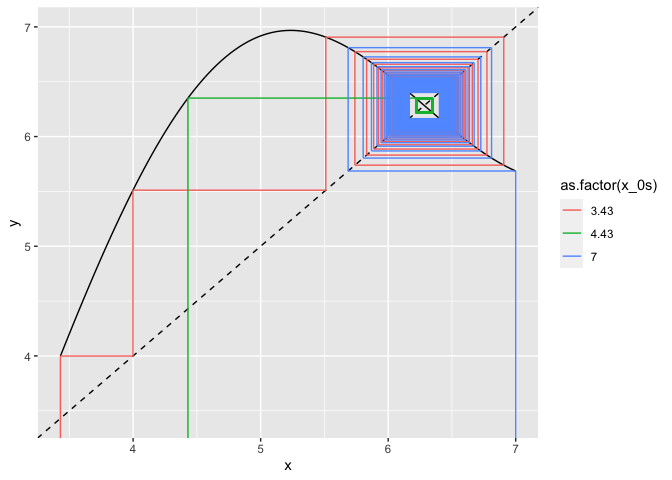
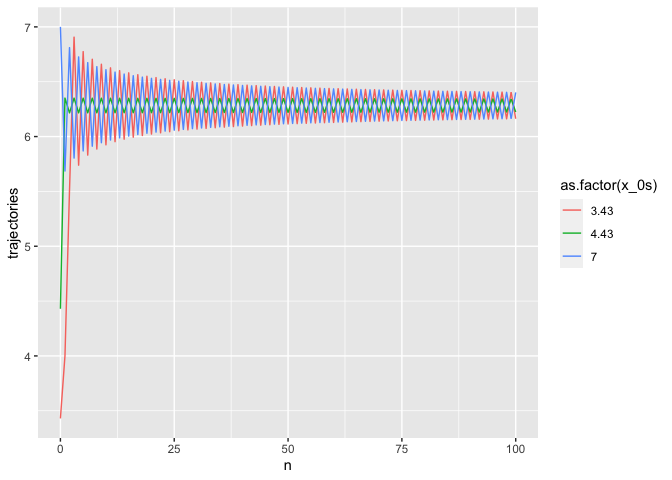

## Graphical iterator program

I’ve written a simple graphical iterator program to help make graphical
iterations on the fly. Here it is:

I can’t guarantee it’ll work for all functions you throw at it, but then
again, I can’t think of any reason why it wouldn’t. Let me know if you
come across any or issues!

## Setup

``` r
# set your initial condition and desired number of iterations:
x_0s <- c(3.43, 4.43, 7)
N <- 100

# set the iteration plot x axis range (lower and upper bounds):
x_min <- 0; x_max <- 8
y_min <- -2; y_max <- 8

use_custom_range_x <- FALSE
use_custom_range_y <- FALSE

# declare your function here:
func <- function(x){
  return(-2 * sin(x) + x) # function goes here
}
```

## The nitty-gritty

``` r
get_function_data <- function(range = c(-1, 1), steps = 100){
  
  steps_multiplier <- (range[2]-range[1])/10 
  if(steps_multiplier < 1){steps_multiplier <- 1}
  # adds steps to get data for depending on the number of 10s 
  # in the specified plot x range
  
  x <- seq(from = range[1], to = range[2], length.out = steps * steps_multiplier)
  
  y <- array(dim = steps * steps_multiplier) 
  for(i in 1:length(x)){
    y[i] <- func(x[i])
    } 
  
  return(data.frame(x = x, y = y))
}

graphical_iterator <- function(x_0s, N = 100){ 
  
  segments <- data.frame()
  for(i in x_0s){
    
    start <- i 
    vert <- FALSE 
    
    x_0 <- rep(i,times=1+(N*2))
    xstarts <- c(start)
    ystarts <- c(y_min)
    xends <- c(start)
    yends <- c(func(start))
    
    # iteratively get the coordinates of the next segment points
    for(i in 1:(2 * N)) 
      # range = 2 * N because every step will be described by two segments
    {
      # if the last segment was vertical, the next must be horizontal
      if(vert){
        xstarts <- c(xstarts, start)
        ystarts <- c(ystarts, start)
        xends <- c(xends, start)
        yends <- c(yends, func(start)) 
        vert <- FALSE
      }
      else{
        xstarts <- c(xstarts, start)
        ystarts <- c(ystarts, func(start)) 
        xends <- c(xends, func(start)) 
        yends <- c(yends, func(start)) 
        vert <- TRUE
        start <- func(start) # update start value
      }
    }
    segments <- rbind(segments, data.frame(x_0s = x_0, xstarts, ystarts, xends, yends))
  }
  return(segments)
}

cobweb_trajects <- graphical_iterator(x_0s = x_0s, N = N)

if(use_custom_range_x == FALSE){
  x_min <- min(cobweb_trajects$xstarts); x_max <- max(cobweb_trajects$xends)
}
if(use_custom_range_y == FALSE){
  y_min <- min(cobweb_trajects$xstarts); y_max <- max(cobweb_trajects$xends)
}

plot_data <- get_function_data(range = c(x_min,x_max)) # gets the plotting data

get_function_iteration_trajectories <- function(x_0s, N = 100){
  
  trajectories <- data.frame()
  
  for(i in x_0s){
    x_t <- i
    
    x_0 <- rep(i,times=N+1)
    n <- 0:N
    
    trajectory <- c(x_t)
    
    for(t in 0:(N-1)){
      x_t <- func(x_t)
      trajectory <- c(trajectory, x_t) # add x_t_1's value to the trajectory vector
    }
    trajectories <- rbind(trajectories, data.frame(x_0s = x_0, ns = n, trajectories = trajectory))
  }
  return(trajectories)
}

trajectories <- get_function_iteration_trajectories(x_0s = x_0s, N = N)
```

## Plots

**Graphical iteration plot:**

``` r
plot_data %>% 
  ggplot(aes(x, y)) +
  geom_line(colour = "black") +
  geom_abline(linetype = "dashed") + 
  geom_segment(data = cobweb_trajects, aes(x = xstarts, y = ystarts, xend = xends, 
                                          yend = yends, colour=as.factor(x_0s))) +
  coord_cartesian(xlim = c(x_min, x_max), ylim = c(y_min, y_max)) 
```

<!-- -->

TODO IN THE FUTURE:

-   Colour segments based on distance to fixed points.
-   Colour segments based on distance to other segments.

**Iteration trajectory time series plot**

``` r
trajectories
```

    ##     x_0s  ns trajectories
    ## 1   3.43   0     3.430000
    ## 2   3.43   1     3.998851
    ## 3   3.43   2     5.510954
    ## 4   3.43   3     6.906425
    ## 5   3.43   4     5.739087
    ## 6   3.43   5     6.774380
    ## 7   3.43   6     5.831020
    ## 8   3.43   7     6.704848
    ## 9   3.43   8     5.886292
    ## 10  3.43   9     6.659402
    ## 11  3.43  10     5.924593
    ## 12  3.43  11     6.626506
    ## 13  3.43  12     5.953274
    ## 14  3.43  13     6.601192
    ## 15  3.43  14     5.975844
    ## 16  3.43  15     6.580895
    ## 17  3.43  16     5.994232
    ## 18  3.43  17     6.564130
    ## 19  3.43  18     6.009603
    ## 20  3.43  19     6.549967
    ## 21  3.43  20     6.022710
    ## 22  3.43  21     6.537790
    ## 23  3.43  22     6.034065
    ## 24  3.43  23     6.527168
    ## 25  3.43  24     6.044029
    ## 26  3.43  25     6.517795
    ## 27  3.43  26     6.052868
    ## 28  3.43  27     6.509441
    ## 29  3.43  28     6.060781
    ## 30  3.43  29     6.501932
    ## 31  3.43  30     6.067919
    ## 32  3.43  31     6.495134
    ## 33  3.43  32     6.074403
    ## 34  3.43  33     6.488940
    ## 35  3.43  34     6.080328
    ## 36  3.43  35     6.483266
    ## 37  3.43  36     6.085769
    ## 38  3.43  37     6.478042
    ## 39  3.43  38     6.090790
    ## 40  3.43  39     6.473211
    ## 41  3.43  40     6.095443
    ## 42  3.43  41     6.468726
    ## 43  3.43  42     6.099770
    ## 44  3.43  43     6.464547
    ## 45  3.43  44     6.103809
    ## 46  3.43  45     6.460641
    ## 47  3.43  46     6.107589
    ## 48  3.43  47     6.456979
    ## 49  3.43  48     6.111139
    ## 50  3.43  49     6.453537
    ## 51  3.43  50     6.114479
    ## 52  3.43  51     6.450293
    ## 53  3.43  52     6.117631
    ## 54  3.43  53     6.447230
    ## 55  3.43  54     6.120611
    ## 56  3.43  55     6.444330
    ## 57  3.43  56     6.123434
    ## 58  3.43  57     6.441579
    ## 59  3.43  58     6.126114
    ## 60  3.43  59     6.438966
    ## 61  3.43  60     6.128663
    ## 62  3.43  61     6.436479
    ## 63  3.43  62     6.131091
    ## 64  3.43  63     6.434108
    ## 65  3.43  64     6.133407
    ## 66  3.43  65     6.431845
    ## 67  3.43  66     6.135619
    ## 68  3.43  67     6.429681
    ## 69  3.43  68     6.137736
    ## 70  3.43  69     6.427610
    ## 71  3.43  70     6.139764
    ## 72  3.43  71     6.425624
    ## 73  3.43  72     6.141709
    ## 74  3.43  73     6.423719
    ## 75  3.43  74     6.143576
    ## 76  3.43  75     6.421889
    ## 77  3.43  76     6.145371
    ## 78  3.43  77     6.420128
    ## 79  3.43  78     6.147098
    ## 80  3.43  79     6.418434
    ## 81  3.43  80     6.148761
    ## 82  3.43  81     6.416801
    ## 83  3.43  82     6.150364
    ## 84  3.43  83     6.415226
    ## 85  3.43  84     6.151911
    ## 86  3.43  85     6.413706
    ## 87  3.43  86     6.153405
    ## 88  3.43  87     6.412237
    ## 89  3.43  88     6.154849
    ## 90  3.43  89     6.410818
    ## 91  3.43  90     6.156246
    ## 92  3.43  91     6.409444
    ## 93  3.43  92     6.157597
    ## 94  3.43  93     6.408114
    ## 95  3.43  94     6.158906
    ## 96  3.43  95     6.406825
    ## 97  3.43  96     6.160175
    ## 98  3.43  97     6.405575
    ## 99  3.43  98     6.161406
    ## 100 3.43  99     6.404363
    ## 101 3.43 100     6.162600
    ## 102 4.43   0     4.430000
    ## 103 4.43   1     6.350785
    ## 104 4.43   2     6.215689
    ## 105 4.43   3     6.350580
    ## 106 4.43   4     6.215893
    ## 107 4.43   5     6.350376
    ## 108 4.43   6     6.216096
    ## 109 4.43   7     6.350174
    ## 110 4.43   8     6.216297
    ## 111 4.43   9     6.349974
    ## 112 4.43  10     6.216496
    ## 113 4.43  11     6.349776
    ## 114 4.43  12     6.216693
    ## 115 4.43  13     6.349580
    ## 116 4.43  14     6.216888
    ## 117 4.43  15     6.349385
    ## 118 4.43  16     6.217082
    ## 119 4.43  17     6.349192
    ## 120 4.43  18     6.217274
    ## 121 4.43  19     6.349001
    ## 122 4.43  20     6.217465
    ## 123 4.43  21     6.348811
    ## 124 4.43  22     6.217653
    ## 125 4.43  23     6.348623
    ## 126 4.43  24     6.217841
    ## 127 4.43  25     6.348437
    ## 128 4.43  26     6.218026
    ## 129 4.43  27     6.348252
    ## 130 4.43  28     6.218210
    ## 131 4.43  29     6.348069
    ## 132 4.43  30     6.218393
    ## 133 4.43  31     6.347887
    ## 134 4.43  32     6.218574
    ## 135 4.43  33     6.347707
    ## 136 4.43  34     6.218753
    ## 137 4.43  35     6.347529
    ## 138 4.43  36     6.218931
    ## 139 4.43  37     6.347351
    ## 140 4.43  38     6.219107
    ## 141 4.43  39     6.347176
    ## 142 4.43  40     6.219282
    ## 143 4.43  41     6.347001
    ## 144 4.43  42     6.219456
    ## 145 4.43  43     6.346828
    ## 146 4.43  44     6.219628
    ## 147 4.43  45     6.346657
    ## 148 4.43  46     6.219799
    ## 149 4.43  47     6.346487
    ## 150 4.43  48     6.219968
    ## 151 4.43  49     6.346318
    ## 152 4.43  50     6.220136
    ## 153 4.43  51     6.346151
    ## 154 4.43  52     6.220303
    ## 155 4.43  53     6.345985
    ## 156 4.43  54     6.220468
    ## 157 4.43  55     6.345820
    ## 158 4.43  56     6.220633
    ## 159 4.43  57     6.345656
    ## 160 4.43  58     6.220795
    ## 161 4.43  59     6.345494
    ## 162 4.43  60     6.220957
    ## 163 4.43  61     6.345333
    ## 164 4.43  62     6.221117
    ## 165 4.43  63     6.345174
    ## 166 4.43  64     6.221276
    ## 167 4.43  65     6.345015
    ## 168 4.43  66     6.221434
    ## 169 4.43  67     6.344858
    ## 170 4.43  68     6.221591
    ## 171 4.43  69     6.344702
    ## 172 4.43  70     6.221746
    ## 173 4.43  71     6.344547
    ## 174 4.43  72     6.221901
    ## 175 4.43  73     6.344393
    ## 176 4.43  74     6.222054
    ## 177 4.43  75     6.344241
    ## 178 4.43  76     6.222206
    ## 179 4.43  77     6.344089
    ## 180 4.43  78     6.222357
    ## 181 4.43  79     6.343939
    ## 182 4.43  80     6.222506
    ## 183 4.43  81     6.343790
    ## 184 4.43  82     6.222655
    ## 185 4.43  83     6.343642
    ## 186 4.43  84     6.222803
    ## 187 4.43  85     6.343495
    ## 188 4.43  86     6.222949
    ## 189 4.43  87     6.343349
    ## 190 4.43  88     6.223094
    ## 191 4.43  89     6.343204
    ## 192 4.43  90     6.223239
    ## 193 4.43  91     6.343060
    ## 194 4.43  92     6.223382
    ## 195 4.43  93     6.342917
    ## 196 4.43  94     6.223524
    ## 197 4.43  95     6.342775
    ## 198 4.43  96     6.223666
    ## 199 4.43  97     6.342635
    ## 200 4.43  98     6.223806
    ## 201 4.43  99     6.342495
    ## 202 4.43 100     6.223945
    ## 203 7.00   0     7.000000
    ## 204 7.00   1     5.686027
    ## 205 7.00   2     6.810617
    ## 206 7.00   3     5.803986
    ## 207 7.00   4     6.726124
    ## 208 7.00   5     5.868931
    ## 209 7.00   6     6.673946
    ## 210 7.00   7     5.912163
    ## 211 7.00   8     6.637300
    ## 212 7.00   9     5.943780
    ## 213 7.00  10     6.609633
    ## 214 7.00  11     5.968272
    ## 215 7.00  12     6.587740
    ## 216 7.00  13     5.988003
    ## 217 7.00  14     6.569831
    ## 218 7.00  15     6.004358
    ## 219 7.00  16     6.554815
    ## 220 7.00  17     6.018212
    ## 221 7.00  18     6.541979
    ## 222 7.00  19     6.030149
    ## 223 7.00  20     6.530838
    ## 224 7.00  21     6.040580
    ## 225 7.00  22     6.521045
    ## 226 7.00  23     6.049799
    ## 227 7.00  24     6.512346
    ## 228 7.00  25     6.058026
    ## 229 7.00  26     6.504550
    ## 230 7.00  27     6.065428
    ## 231 7.00  28     6.497509
    ## 232 7.00  29     6.072136
    ## 233 7.00  30     6.491108
    ## 234 7.00  31     6.078252
    ## 235 7.00  32     6.485256
    ## 236 7.00  33     6.083860
    ## 237 7.00  34     6.479876
    ## 238 7.00  35     6.089026
    ## 239 7.00  36     6.474909
    ## 240 7.00  37     6.093806
    ## 241 7.00  38     6.470305
    ## 242 7.00  39     6.098246
    ## 243 7.00  40     6.466020
    ## 244 7.00  41     6.102385
    ## 245 7.00  42     6.462019
    ## 246 7.00  43     6.106255
    ## 247 7.00  44     6.458272
    ## 248 7.00  45     6.109885
    ## 249 7.00  46     6.454754
    ## 250 7.00  47     6.113298
    ## 251 7.00  48     6.451441
    ## 252 7.00  49     6.116516
    ## 253 7.00  50     6.448314
    ## 254 7.00  51     6.119556
    ## 255 7.00  52     6.445357
    ## 256 7.00  53     6.122434
    ## 257 7.00  54     6.442554
    ## 258 7.00  55     6.125164
    ## 259 7.00  56     6.439893
    ## 260 7.00  57     6.127759
    ## 261 7.00  58     6.437362
    ## 262 7.00  59     6.130229
    ## 263 7.00  60     6.434950
    ## 264 7.00  61     6.132584
    ## 265 7.00  62     6.432649
    ## 266 7.00  63     6.134834
    ## 267 7.00  64     6.430450
    ## 268 7.00  65     6.136984
    ## 269 7.00  66     6.428346
    ## 270 7.00  67     6.139043
    ## 271 7.00  68     6.426330
    ## 272 7.00  69     6.141017
    ## 273 7.00  70     6.424397
    ## 274 7.00  71     6.142912
    ## 275 7.00  72     6.422540
    ## 276 7.00  73     6.144732
    ## 277 7.00  74     6.420755
    ## 278 7.00  75     6.146483
    ## 279 7.00  76     6.419037
    ## 280 7.00  77     6.148169
    ## 281 7.00  78     6.417382
    ## 282 7.00  79     6.149793
    ## 283 7.00  80     6.415787
    ## 284 7.00  81     6.151360
    ## 285 7.00  82     6.414248
    ## 286 7.00  83     6.152873
    ## 287 7.00  84     6.412761
    ## 288 7.00  85     6.154334
    ## 289 7.00  86     6.411324
    ## 290 7.00  87     6.155748
    ## 291 7.00  88     6.409934
    ## 292 7.00  89     6.157115
    ## 293 7.00  90     6.408588
    ## 294 7.00  91     6.158439
    ## 295 7.00  92     6.407285
    ## 296 7.00  93     6.159722
    ## 297 7.00  94     6.406021
    ## 298 7.00  95     6.160967
    ## 299 7.00  96     6.404796
    ## 300 7.00  97     6.162174
    ## 301 7.00  98     6.403607
    ## 302 7.00  99     6.163346
    ## 303 7.00 100     6.402452

``` r
# trajectory plot
trajectories %>% 
  ggplot(aes(ns, trajectories, colour = as.factor(x_0s))) +
  geom_line() + labs(x="n")
```

<!-- -->

``` r
# TODO
# average distances between trajectories plot

# mean(dist(c(1:10))) # mean of distances between whole numbers from 1 to 10 (example)

# trajectories$x_0s <- paste0('x_0_', trajectories$x_0s)
# trajectories_wide <- trajectories %>% 
#   pivot_wider(names_from = x_0s, values_from = trajectories) %>% 
#   mutate(distance = (x_0_2.01-x_0_2))
# 
# trajectories_wide
# 
# trajectories_wide %>% 
#   ggplot(aes(ns, distance)) +
#   geom_point() + geom_line() +
#   labs(x="n", y="distance between trajectories")
```
