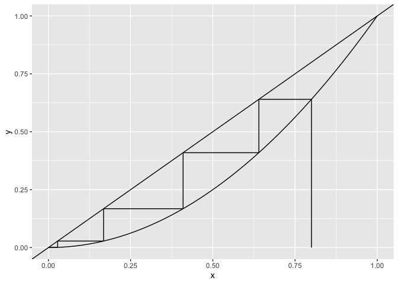

## Graphical iterator program

I’ve written a simple graphical iterator program to help make graphical
iterations on the fly. Here it is:

I can’t guarantee it’ll work for all functions you throw at it, but then
again, I can’t think of any reason why it wouldn’t. Let me know if you
come across any or issues!

``` r
# declare your function here:
func <- function(x){
  return(x ^ 2) # function
}

get_function_data <- function(range = c(-1, 1), steps = 100){
  x <- seq(from = range[1], to = range[2], length.out = steps)
  
  y <- array(dim = steps) 
  for(i in 1:length(x)){
    y[i] <- func(x[i])
    } 
  
  return(data.frame(x = x, y = y))
}

graphical_iterator <- function(x_0, N = 100){ 
  
  start <- x_0 
  vert <- FALSE 
  
  xstarts <- c(start)
  ystarts <- c(0)
  xends <- c(start)
  yends <- c(func(start)) 
  
  # iteratively get the coordinates of the next segment points
  for(i in 1:(2 * N)) 
    # range = 2 * N because every step will be described by two segments
  {
    # if the last segment was vertical, the next must be horizontal
    if(vert){
      xstarts <- c(xstarts, start)
      ystarts <- c(ystarts, start)
      xends <- c(xends, start)
      yends <- c(yends, func(start)) 
      vert <- FALSE
    }
    else{
      xstarts <- c(xstarts, start)
      ystarts <- c(ystarts, func(start)) 
      xends <- c(xends, func(start)) 
      yends <- c(yends, func(start)) 
      vert <- TRUE
      start <- func(start) # update start value
    }
  }
  return(data.frame(xstarts, ystarts, xends, yends))
}

plot_data <- get_function_data(range = c(0,1))
cobweb_traject <- graphical_iterator(x_0 = 0.8, N = 100)

plot_data %>% 
  ggplot(aes(x, y)) +
  geom_line() +
  geom_abline() + 
  geom_segment(data = cobweb_traject, aes(x = xstarts, y = ystarts, xend = xends, 
                                          yend = yends))
```

<!-- -->
