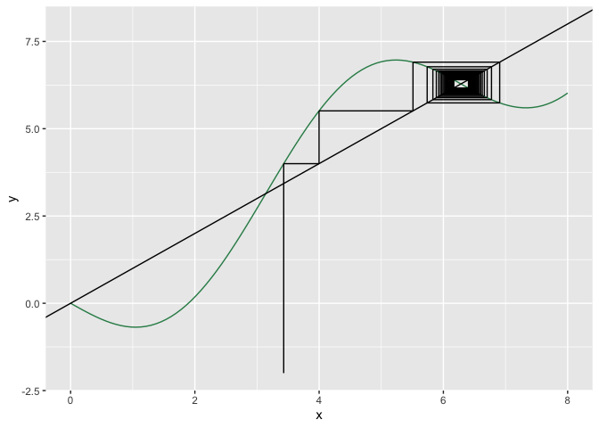
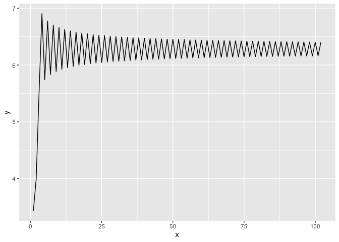

## Graphical iterator program

I’ve written a simple graphical iterator program to help make graphical
iterations on the fly. Here it is:

I can’t guarantee it’ll work for all functions you throw at it, but then
again, I can’t think of any reason why it wouldn’t. Let me know if you
come across any or issues!

## Setup

``` r
# set your initial condition and desired number of iterations:
x_0 = 3.43
N = 100

# set the iteration plot x axis range (lower and upper bounds):
x_min <- 0; x_max <- 8
use_custom_range <- TRUE

# declare your function here:
func <- function(x){
  return(-2 * sin(x) + x) # function goes here
}
```

## The nitty-gritty

``` r
get_function_data <- function(range = c(-1, 1), steps = 100){
  
  steps_multiplier <- (range[2]-range[1])/10 
  # adds steps to get data for depending on the number of 10s 
  # in the specified plot x range
  
  x <- seq(from = range[1], to = range[2], length.out = steps * steps_multiplier)
  
  y <- array(dim = steps * steps_multiplier) 
  for(i in 1:length(x)){
    y[i] <- func(x[i])
    } 
  
  return(data.frame(x = x, y = y))
}

graphical_iterator <- function(x_0, N = 100){ 
  
  start <- x_0 
  vert <- FALSE 
  
  xstarts <- c(start)
  ystarts <- c(0)
  xends <- c(start)
  yends <- c(func(start)) 
  
  # iteratively get the coordinates of the next segment points
  for(i in 1:(2 * N)) 
    # range = 2 * N because every step will be described by two segments
  {
    # if the last segment was vertical, the next must be horizontal
    if(vert){
      xstarts <- c(xstarts, start)
      ystarts <- c(ystarts, start)
      xends <- c(xends, start)
      yends <- c(yends, func(start)) 
      vert <- FALSE
    }
    else{
      xstarts <- c(xstarts, start)
      ystarts <- c(ystarts, func(start)) 
      xends <- c(xends, func(start)) 
      yends <- c(yends, func(start)) 
      vert <- TRUE
      start <- func(start) # update start value
    }
  }
  return(data.frame(xstarts, ystarts, xends, yends))
}

cobweb_traject <- graphical_iterator(x_0 = x_0, N = N)
if(use_custom_range == FALSE){
  x_min <- min(cobweb_traject$xstarts); x_max <- max(cobweb_traject$xends)
}
plot_data <- get_function_data(range = c(x_min,x_max))

get_function_iteration_trajectory <- function(x_0, N = 100){
  
  x_t <- x_0
  trajectory <- c(x_t)
  
  for(t in 0:N-1){
    x_t <- func(x_t)
    trajectory <- c(trajectory, x_t) # add x_t_1's value to the trajectory vector
  }
  return(trajectory)
}

trajectory <- get_function_iteration_trajectory(x_0 = x_0, N = N)
trajectory <- data.frame(x = 1:length(trajectory), y = trajectory)
```

## Plots

**Graphical iteration plot:**

``` r
plot_data %>% 
  ggplot(aes(x, y)) +
  geom_line(colour = "seagreen") +
  geom_abline() + 
  geom_segment(data = cobweb_traject, aes(x = xstarts, y = ystarts, xend = xends, 
                                          yend = yends)) +
  coord_cartesian(xlim = c(x_min, x_max))
```

<!-- -->

TODO IN THE FUTURE:

Colour segments based on distance to fixed points.

**Iteration trajectory time series plot**

``` r
trajectory %>% 
  ggplot(aes(x, y)) +
  geom_line()
```

<!-- -->
